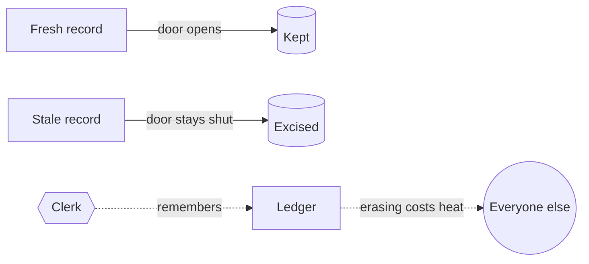

---
tags:
  - physics/statistical/thermodynamics
created: 2026-09-23
cssclasses:
  - banner
  - banner-fade
---

![[Hubble Running Man Nebula.jpg|banner]]

## Maxwell's Demon Works at Archive

```card
id: landauer-bound
q: What is the minimum heat cost of erasing one bit of memory at temperature $T$?
a: $k_B T \ln 2$, the Landauer bound.
topic: physics/thermodynamics
created: 2026-09-23
```
Maxwell's demon sits at a door between two gas chambers and lets only fast molecules through one way. It seems to build a temperature difference for free. The catch, settled by Landauer and Bennett, is that the demon has to remember what it saw, and erasing a bit of memory costs at least $k_B T \ln 2$ of heat.

So the demon does not break the second law. It moves the cost into its filing system.

The Records floor on [[Continuum/Time/Daily/2026-09-23|Wednesday]] was the same machine at human scale: clerks routing fresh records one way and stale ones the other, for a company whose product is order. The bill arrives as people, overtime, and eventually as the [[Clean Cut]]: when a history is too expensive to keep sorted, you cut it out.



Related: [[A Record Is a Vote for a Past]].
