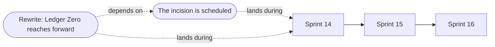

---
tags:
  - philosophy/decision
created: 2026-09-24
cssclasses:
  - banner
  - banner-fade
---

![[Hubble Running Man Nebula.jpg|banner]]

## "Next Sprint" Is a Claim About Causality

Moving a problem to the next sprint assumes that the problem will wait: that time is a queue, and whatever is in it arrives in order.

Rewrites do not work that way. A rewrite lands when its dependencies are ready, not when the calendar says so. Rewrite order is a partial order on causes, and two rewrites can be simultaneous in that order while being centuries apart on the calendar. The news from the [[Salt Meridian War]] regularly arrives before the battle.

So when [[Maren Holt]] moved Archive's own origin to the next sprint, she was betting that Archive's origin is the kind of thing that respects a backlog. On [[Continuum/Time/Daily/2026-09-22|Tuesday]] it had already started acting on its own.
