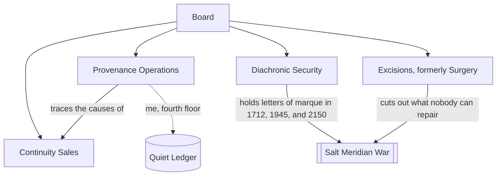

---
tags:
  - type/hub
  - job/archive
aliases: [Archive Continuity Holdings, Work]
created: 2026-09-08
status: active
cssclasses:
  - banner
  - banner-fade
---

![[Webb Cosmic Cliffs.jpg|banner]]

> [!media-frame]
> ![[Archive seal.svg|The Archive seal, its founding year corrected by hand]]

## Where I Work

Archive sells proof that you happened. For a monthly fee it writes you into registries, parish books, school photos, server logs, and other people's memories, so that when history is rewritten around you there is enough evidence left that you stay in it. The slogan is "You were here. We can prove it." The small print is "for as long as your plan is active."

It is also the largest company that has ever existed, and it has become so recently, in every century at once. Governments subscribe like everyone else. In March the Ministry of the Interior's plan lapsed for eleven days, and for eleven days nobody could remember who was in charge of the police.

I am a provenance analyst on the fourth floor. I trace why things exist. Mostly this is paperwork.

> [!info] The name
> In Daemonist seminars an *Archive* is an aeon recorded so densely that nothing in it can be rewritten any more: a finished, perfectly witnessed universe. Marketing says the company was named after the idea. The Daemonists say the idea was named after the company. Both claims have excellent records.

## Continuity Plans

| Plan | What you get | If you cancel |
| --- | --- | --- |
| Witness | Three independent records a year and one person who will swear they met you | You thin out: people forget your name at parties |
| Ledger | Forty databases, a birthday card from someone who means it, a name on a school photo | Your childhood becomes "unverified" |
| Perpetual | A street, a footnote in a textbook, a descendant | The cancellation fee is retroactive |

Employees get the Ledger plan free. It is the only reason most of us stay.

## How It Is Built



Diachronic Security is the part nobody mentions at dinner. It has a licence to use force, issued three times by three governments that Archive later made sure had existed.

## History, as of This Week

```chronos
- [1683] A salt merchant pays a notary to record that his drowned son existed: [[Ledger Zero]]
@ [1679~1688] #red The Salt Meridian War, fought over the 2140s
- [2019] Archive founded in a Rotterdam basement
- [2021] First rewrite survived by a paying customer
= [2026-03] The Ministry lapse
- [2026-09-22] Archive has always been founded in 1683
```

The 2019 entry is still in my notes and in nobody else's. See [[Continuum/Time/Daily/2026-09-22|Tuesday]].

## Now

- My current project is [[Clean Cut]], the incision of the [[Salt Meridian War]]. Its steering deck is [[Clean Cut Briefing]], and the computation is the [[Orrery Rerouting Run]].
- The armed part of the company: [[Diachronic Security]].
- Reference for the floor: [[Rot Tier Field Card]] and the [[Archive Glossary]]. What they give you on day one: [[Analyst Onboarding]].
- People: [[Maren Holt]], [[Sergeant Dace]], and, until recently, [[Tomas Brandt]].
- The thing I do after hours: [[Quiet Ledger]].

```dataview
TABLE WITHOUT ID file.link AS Note, file.etags AS Tags, created AS Started
FROM "Underwork/Archive"
WHERE file.name != "Archive"
SORT created DESC
```
