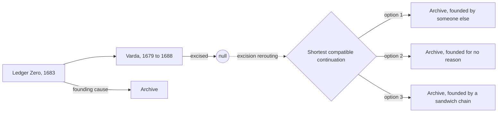

---
tags:
  - type/project
  - job/archive/clean-cut
aliases: [The Varda Incision, Project CLEAN CUT]
created: 2026-09-08
status: active
cssclasses:
  - banner
  - banner-fade
---

![[Webb Cosmic Cliffs.jpg|banner]]

## The Brief

Remove the [[Salt Meridian War]] from history. Specifically: excise the Varda salt flats, 1679 to 1688, from admissible history, let the surrounding centuries route around the gap, and stop paying three hundred and forty analysts to argue about who is winning a war that is fought in the seventeenth century over the 2140s.

Legal calls it an *incision*, because an incision is something a surgeon does on purpose. Physics calls it an *excision*: a bounded region with null admission, no recoverable provenance, and history taking the shortest way around. I call it what the ticket calls it, CLEAN CUT, because I have to type it forty times a day.

The zone is on the [[Underwork/Archive/Varda Zone.canvas|zone map]]. The sprint lives on the [[Underwork/Archive/Clean Cut Board|board]], and Monday's pitch is the [[Clean Cut Briefing|steering deck]].

## What Changed on Tuesday

My provenance trace came back on [[Continuum/Time/Daily/2026-09-22|Tuesday]]. One of the causes of Archive is inside the zone.

It is [[Ledger Zero]]: a notary's entry from 1683 in which a salt merchant paid to have it written down that his drowned son had existed. Every Archive founding story, every contract template, and, since Tuesday, the founding year itself, descend from that page. Cut Varda out, and Archive keeps existing with *black provenance*: continuity without a recoverable origin. Nobody knows what a company with no reason to exist does next. Probably the same things, but faster.

The steering meeting took eleven minutes. The decision was to move it to the next sprint.

## The Computation

Rerouting is being computed on the Orrery cluster ([[Orrery Rerouting Run|run log]]): for every candidate continuation, where does Archive's reason for existing move to? Estimated runtime is eleven weeks. Estimated confidence at the end is "high", which is what the dashboard says about everything.

Nobody has asked what happens to the three thousand people who live on the salt flats in 1683. [[Maren Holt]] called it "a values conversation, not a scope conversation". The policy slide says clean deletion is "often more merciful than surviving a bad rewrite". It is a well-designed slide. The [[Varda Parish Register]] has all their names, and I have started copying them into the [[Quiet Ledger]].

## Work

- [x] Trace the provenance of every Archive asset with roots inside Varda #task ✅ 2026-09-22
- [/] Write up Ledger Zero for the steering group so that the ticket cannot be closed without reading it #task
- [ ] Price the causal-armor option: four million external copies of Ledger Zero before the cut #task 📅 2026-10-02
- [>] Decide whether Archive needs an origin at all #task
- [w] Wait for the Orrery rerouting results #task
- [w] Ask [[Diachronic Security]] why their 1712 letter of marque is dated from inside the zone #task
